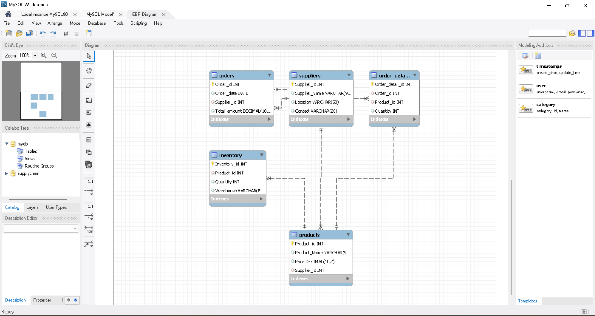

# supply_chain_project_sql
# 📦 Supply Chain Management Database (MySQL)

## 🧠 Project Overview

This project implements a relational database for a Supply Chain Management system using MySQL.  
It models suppliers, products, inventory, and orders to analyze supply chain operations and support data-driven decision-making.

The database demonstrates real-world business scenarios such as supplier-product relationships, stock monitoring, and order tracking.

---

## 🎯 Objectives

- Design a normalized relational database
- Establish relationships using primary and foreign keys
- Manage supplier, product, inventory, and order data
- Perform analytical queries for business insights
- Demonstrate SQL skills including JOINs, aggregation, and subqueries

---

## 🛠️ Tools & Technologies Used

- MySQL
- MySQL Workbench
- SQL (DDL, DML, DQL)
- Relational Database Design

---

## 🗂️ Database Schema

The system consists of the following tables:

### 👥 Suppliers
Stores supplier information.

| Column | Description |
|--------|------------|
| Supplier_id | Unique supplier ID |
| Supplier_Name | Name of supplier |
| Location | Supplier location |
| Contact | Contact number |

---

### 🖥️ Products
Stores product details supplied by suppliers.

| Column | Description |
|--------|------------|
| Product_id | Unique product ID |
| Product_Name | Product name |
| Price | Product price |
| Supplier_id | Linked supplier |

---

### 📦 Inventory
Tracks product stock across warehouses.

| Column | Description |
|--------|------------|
| Inventory_id | Unique inventory record |
| Product_id | Linked product |
| Quantity | Available stock |
| Warehouse | Storage location |

---

### 🧾 Orders
Stores supplier order information.

| Column | Description |
|--------|------------|
| Order_id | Unique order ID |
| Order_date | Date of order |
| Supplier_id | Supplier placing order |
| Total_amount | Order value |

---

### 📑 Order_Details
Stores detailed items within each order.

| Column | Description |
|--------|------------|
| Order_detail_id | Unique detail ID |
| Order_id | Linked order |
| Product_id | Ordered product |
| Quantity | Quantity ordered |

---

## 🔗 Entity Relationships

- One supplier can supply multiple products
- One supplier can have multiple orders
- Each product can exist in inventory
- Each order can contain multiple products
- Order details link orders and products

---

## 📊 Key SQL Queries Implemented

✔ Display products with supplier names  
✔ Inventory details with product information  
✔ Products with low stock  
✔ Total products supplied by each supplier  
✔ Orders with supplier details  
✔ Suppliers who have placed orders  
✔ Suppliers with above-average order value  

---

## 📷 ER Diagram

> Add your ER diagram image here



---

## 📂 Files Included

- `SupplyChain.sql` — Database creation and queries  
- `datasets/` — CSV data files (optional)  
- `er_diagram.png` — Entity Relationship Diagram  
- `query_output.png` — Sample query results  

---

## 🚀 How to Run the Project

1. Install MySQL and MySQL Workbench
2. Open MySQL Workbench
3. Run the SQL script:

```sql
SOURCE SupplyChain.sql;
